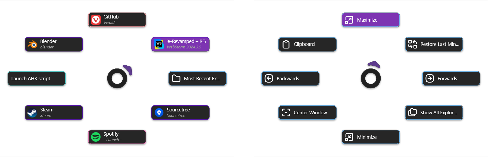

# MightyPie Revamped — Customizable Pie Menu for window switching and more

This is the second iteration of _MightyPie_, a window switcher (and much more) for Windows, inspired by Blender's pie
menus. My original aim was to get rid of the taskbar — have everything right at your cursor-tip and reclaim the space as
a bonus. And at the same time to create something smoother and more predictable than Alt+Tab — no more switching
to the wrong window because of everything moving around all the time.
But of course a Pie Menu can be used for much more
than just window switching.

  

  <i>Pie Menus — different border colors show the different button types</i>

## Contents

- [What's New](#whats-new)
- [Features](#features)
- [Usage](#usage)
- [Installation](#installation)
- [Known Issues / Limitations](#known-issues--limitations)
- [Debugging](#debugging)
- [Power User Stuff](#power-user-stuff)

> [!NOTE]
> This is now my second "real" program, but creating it was quite a bit more complex than the first version of
_MightyPie_. This means, once
> again, there are almost certainly bugs and rough edges here and there, so use at your own discretion. I welcome
> feedback and contributions, but I may not actively maintain or expand the project beyond its
> current state.

## What's New

**_MightyPie Revamped_** is based on Tauri, which means no more DPI-problems. The UI should remain crisp in
multi-monitor setups and when switching between displays.

The available programs for Launch-Program and Show-Program-Window buttons are now gathered at startup from all installed
programs. Previously, _MightyPie_ collected only open programs in a cache, which of course made for a very limited and
clunky selection, but it also often lead to broken file paths after programs updated. _MightyPie Revamped_ uses a
sophisticated (at least I'd like to think so) system to find and filter all installed
programs that someone would likely want to launch.

Beyond that, we have more and improved features, better and more intuitive UI, better organization and an
overall more snappy experience.

The Pie Menu itself though works just the same as it always has. But instead of two menus with three pages each, they
are now basically unlimited.

And if you can't seem to find a window among all your new Pie Menus, you can now use a Search Box to find them by title
or application name.

## Features

### **Multiple Pie Menus**

Create basically unlimited Pie Menus, each with their own assignable hotkey. Each Menu has a customizable number of
Pages
with eight configurable buttons each.

### **Six Button Functionalities**

| Button Type                                 | Description                                                                                                                                                                                                                |
|---------------------------------------------|----------------------------------------------------------------------------------------------------------------------------------------------------------------------------------------------------------------------------|
| **Show Any Window**                         | This button is assigned any open window. - Left-click brings the window to the foreground. - Left-click while the window is already in the foreground will minimize the window. - Middle-click closes the window. |
| **Show Program Window**                     | This button is assigned only windows that belong to the specified application. If no window of that type is open, it behaves like the _Launch Program_ button. Otherwise, it behaves the same as _Show Any Window._        |
| **Launch Program**                          | Launches an instance of the specified application.                                                                                                                                                                         |
| **Call Function**                           | Executes handy functions from the available functions list, i.e. Play, Pause, Maximize under cursor etc.                                                                                                                   |
| **Open specific Page in Pie Menu** _(new!)_ | Opens any existing page you choose in any menu. You can assign it a custom text label.                                                                                                                                     |
| **Open Resource** _(new!)_                  | Opens any file or folder you choose (using the default application). You can assign it a custom text label as well.                                                                                                        |

### **Quick Menu:**

- Middle-click the Center in any Pie Menu to open the Quick Menu.
- Here you can get to the Settings, Pie Menu Configuration and the Fuzzy Search. (... and toggle Dark Mode!)
- Fill Gaps: _Show Any Window_ buttons keep their place as long as they are open. If you want to fill any gaps from
  closed windows, this is how. (Lowest indexes of menus/pages/buttons are always assigned first.)
- Access your favorite menu directly, which you can set in the Pie Menu Configuration.

### Pie Menu Configuration

- Create menus, add pages and assign all your buttons here. Assign keyboard shortcuts for each menu.
- _(new!)_ Save and Load your Configuration with backup files.
- _(new!)_ Choose one menu to be displayed in the Quick Menu.
- _(new!)_ Quickly make all Buttons of a page the same type.

### Settings

- Customize colors, choose what a left-click in the Pie Menu center does and more.
- At the bottom are shortcuts to the Installation folder and the App Data folder. The Pie Menu Configuration, Settings
  and Shortcuts are all stored there.
- Set Autostart policy (with/without Admin Rights)

> [!NOTE]
> In order for _MightyPie Revamped_ to work when focused on a program that runs with admin privileges (like Task
> Manager), you need to run _MightyPie Revamped_ with admin privileges as well. You also need admin privileges to change
> these settings. (They are turned off by default.)

### Fuzzy Search _(new!)_

- Fuzzy Search for any open window — by title or application name — and bring it to the foreground.
- Accessible from the Quick Menu, but can also be assigned to buttons via the _Call Function_ buttons.

### Tray Icon _(new!)_

- Left-click to open Quick Menu. Context menu gives direct access to the Settings, Pie Menu Configuration without
  opening a Pie Menu. Helpful if you haven't set a keyboard shortcut (or forgot it).

## Usage

MightyPie works with a cache (App Info Cache) that holds the info (name, path, icon path) for all the programs the user
has opened once. This cache is the working basis for all program-related buttons, i.e. their UI and launch paths

1. **Run the application:** The program is portable so just run MightyPie.exe.

2. **Configure Hotkeys:** The settings open at the first start. Here you can configure your hotkeys. (Default are
   _Alt+F1_ for the Primary Pie Menu and _Alt+F2_ for the Secondary Pie Menu. The hotkeys are keyboard only and some
   restriction apply, i.e. Windows Key can't be used.

   (Be aware that many key combinations are already in use by programs, though MightyPie will suppress them. I
   personally use AHK to map mouse buttons to keys like _F13_ and _F14_ and use those as hotkeys.)

3. **Trigger the Pie Menu:** The Pie Menu opens on button-down. You can also hold the hotkey, hover over a button (or
   its section) and just release for triggering a button.

4. **Pie Menu:** Use the mouse to select a button in the pie menu.
    - _Left-click_ is the normal function.
    - _Middle-click_ on Show Window Buttons will close that window.
    - _Right-click_ anywhere will close the Pie Menu.
    - _Left-click_ on the Center Button of a Pie Menu triggers the "forward" mouse button by default (because I am using
      that for opening the Pie Menu and this way I still have that functionality). You can also set it to "backward" or
      nothing.

5. **Special Menu:** More Windows functions and settings.

- _Middle-click_ the Center Button in any Pie Menu to open the Special Menu.
- All the buttons have tool tips.

- The Startup section is only visible when run with elevated privileges, which I recommend anyway, since MightyPie will
  otherwise not work when programs with elevated privileges are in the foreground (like Task Manager). "Start with
  Windows" creates (or removes) a task in the Task Scheduler, hence the shortcut there.

- the Invisible UI right now consists of two buttons on the left edge and at the bottom of the screen respectively. The
  one on the left opens an explorer window and the one at the bottom toggles Taskbar visibility (just like the toggle in
  the menu)
- in the App Data folder, you find json files which save the Button Config, the App Settings and the App Info Cache (you
  normally don't have to interact with those directly but if you have problems, try deleting these files to get reset
  the whole program).

- the other unlabeled buttons are:
    - **Windows Shortcuts:**
        - Open Task Manager
        - Open Sound Settings
        - Open Network Settings
        - Open Projection Settings (Windows monitor switching)
        - Open an explorer window

- **Monitor Switching:** The Monitor Switching area is turned off in the settings by default. It uses my specific
  shortcuts set in DisplayFusion to switch screens and is probably of use for anyone else. (You can change the shortcuts
  though.)

- **MightyPie Shortcuts:**
    - Clear / Reset the App Info Cache
    - Re-assign all Buttons: will re-assign Show Any Window Buttons starting on the lower Pie Menu levels first. (
      normally windows will stay on one button, once assigned)
    - Open the Button Config: Here you can assign the functions of all buttons in all Pie Menus
    - Open App Settings: General Settings of MightyPie (settings require a restart to take effect)
    - Restart
    - Quit

> [!NOTE]
> You can assign almost any keyboard key, combined with any modifier, as a shortcut. In theory, you could use even use
> something like `Ctrl + VolumeUp`. I don't know why you'd want that, but I won't judge. Though some keys might not have
> human-readable names. Only the `Escape` key is not usable.
>
> **Be aware that the shortcuts you set for your Pie Menus are blocked for everything else!**

## Installation

Download the executable from the [releases](https://github.com/RayzorBlade23/MightyPie-Revamped/releases) page and run
it. It should work in whatever location you put it.

Note: There is no portable version of **_MightyPie Revamped_** unlike the original _MightyPie_.

## Known Issues / Limitations

- Some of the functions that can be used with the Function Call buttons use keyboard input simulation, i.e. Open
  Clipboard (`Win + V`), Copy (`Ctrl + C`) etc. So if you use a keyboard shortcut for opening your Pie Menu that uses
  modifiers (like
  `Alt`, `Ctrl`, `Win`, `Shift`) and try to drag-select the button, the action is likely to fail, since there are too
  many
  modifiers pressed that
  break the intended shortcut for the function (i.e. `Ctrl + C` should be executed but effectively
  `Ctrl + Shift + Alt + C` might be
  pressed). It might work, if you're quick to release the modifiers, since there is a small delay in the
  execution of those buttons. In any case, it should work if you select the button via normal left-click.
- Sometimes a window is not being focused first try. Tried a lot of things to get this consistent but it's still not a
  100%. At this point I assume it is a quirk of Windows.

## Debugging

You can find the log files in the app data folder `AppData\Local\MightyPieRevamped\logs\`. There is also a shortcut at
the bottom
of the Settings menu to open this folder directly.

By default, the logging level is set to `info`. To change it, find `MightyPieRevamped.lnk` from the start menu, and in
the properties, in the `Target` field, add
` -- --log-level debug` (or `error`/`warn` instead of `info`) after the path.

## Power User Stuff

- The Pie Menu Configuration, Settings and Shortcuts are all stored in the App Data folder:
    - `AppData\Local\MightyPieRevamped\buttonConfig.json`
    - `AppData\Local\MightyPieRevamped\settings.json`
    - `AppData\Local\MightyPieRevamped\shortcuts.json`

- There is also `windowExclusionList.json`, where you can define windows by application or title (or both) to exclude
  them from the Pie Menus entirely.
- You can also adjust the NATS configuration (it's how Tauri communicates with the backend), if you have trouble with
  the ports.