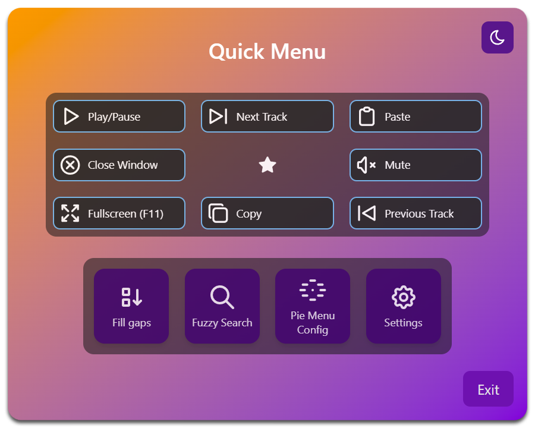

# MightyPie Revamped — Customizable Pie Menu for window switching and more

This is the second iteration of _MightyPie_, a window switcher (and much more) for Windows, inspired by Blender's pie
menus. My original aim was to get rid of the taskbar — have everything right at your cursor-tip and reclaim the space as
a bonus. And at the same time to create something smoother and more predictable than `Alt`/`Win`+`Tab` — no more
switching
to the wrong window because of everything moving around all the time.
But of course a Pie Menu can be used for much more
than just window switching.

  

  <i>Pie Menus — different border colors show the different button types</i>

## Contents

- [What's New](#whats-new)
- [Features](#features)
- [Installation](#installation)
- [Usage](#usage)
- [Known Issues / Limitations](#known-issues--limitations)
- [Advanced Usage](#advanced-usage)
    - [Debugging](#debugging)
    - [Configuration Files](#configuration-files)

> [!NOTE]
> This is now my second "real" program, but creating it was quite a bit more complex than the first version of
_MightyPie_. This means, once
> again, there are almost certainly bugs and rough edges here and there, so use at your own discretion. I welcome
> feedback and contributions, but I may not actively maintain or expand the project beyond its
> current state. Though I will most likely patch major bugs and issues.

## What's New

**_MightyPie Revamped_** is based on Tauri, which means no more DPI-problems. The UI should remain crisp in
multi-monitor setups and when switching between displays.

The available programs that can be assigned to _Launch Program_ and _Show Program Window_ buttons are now gathered at
startup from all installed
programs. Previously, _MightyPie_ collected only open programs in a cache, which of course made for a very limited and
clunky selection, but it also often lead to broken file paths after programs updated. _MightyPie Revamped_ uses a more
sophisticated (at least I'd like to think so) system to find and filter all installed
programs that someone would likely want to launch.

Beyond that, we have more and improved features, better and more intuitive UI, better organization and an
overall more snappy experience.

The Pie Menu itself though works just the same as it always has. But instead of two menus with three pages each, they
are now basically unlimited.

And if you can't seem to find a window among all your new Pie Menus, you can now use a Search Box to find them by title
or application name.

## Features

### **Multiple Pie Menus**

Create basically unlimited Pie Menus, each with their own assignable keyboard shortcut. Each Menu has a customizable
number of
Pages with eight configurable buttons each.

### **6 Button Types**

| Button Type                                 | Description                                                                                                                                                                                                                               |
|---------------------------------------------|-------------------------------------------------------------------------------------------------------------------------------------------------------------------------------------------------------------------------------------------|
| **Show Any Window**                         | This button is assigned any open window. - Left-click brings the window to the foreground. - Left-click while the window is already in the foreground will minimize the window. - Middle-click closes the window.                |
| **Show Program Window**                     | This button is assigned only windows that belong to the specified application. It otherwise reacts the same as _Show Any Window_ buttons. If no window of the specified application is open, it behaves like the _Launch Program_ button. |
| **Launch Program**                          | Launches an instance of the specified application.                                                                                                                                                                                        |
| **Call Function**                           | Executes handy functions from the available functions list, i.e. Play, Pause, Maximize under cursor etc.                                                                                                                                  |
| **Open specific Page in Pie Menu** _(new!)_ | Opens any existing page you choose in any menu. You can assign it a custom text label.                                                                                                                                                    |
| **Open Resource** _(new!)_                  | Opens any file or folder you choose (using the default application). You can assign it a custom text label as well.                                                                                                                       |
| **Keyboard Shortcut** _(new!)_              | Executes a keyboard shortcut. (valid keys can be found [here](assets/KeyboardShortcutButton-ValidKeys.md))                                                                                                                                |

### **Quick Menu:**

- Middle-click the Center in any Pie Menu to open the Quick Menu (or by clicking the tray icon).
- Here you can get to the Settings, Pie Menu Configuration and the Fuzzy Search. (... and toggle Dark Mode!)
- Fill Gaps: _Show Any Window_ buttons keep their assigned window as long as they are open. If you want to fill any gaps
  from
  closed windows, this will re-assign all buttons. (Lowest indexes of menus/pages/buttons are always assigned first.)
- Access your favorite menu directly, which you can set in the Pie Menu Configuration.
- The _Quick Menu_ auto-closes when you click anywhere else.

  

### Pie Menu Configuration

- Create Menus, add Pages and assign all your Buttons here. Assign keyboard shortcuts for each menu.
- _(new!)_ Save and Load your Configurations.
- _(new!)_ Choose one Page to be displayed in the Quick Menu.
- _(new!)_ Quickly make all Buttons of a page the same type.

  

### Settings

- Customize colors, choose what a left-click in the Pie Menu center does and more.
- At the bottom are shortcuts to the Installation folder and the App Data folder. The Pie Menu Configuration, Settings
  and Shortcuts are all stored there.
- Set Autostart policy (with/without Admin Rights)

> [!NOTE]
> In order for _MightyPie Revamped_ to work when a program that runs with admin privileges is in the foreground (like
> Task
> Manager), you need to run _MightyPie Revamped_ with admin privileges as well. You also need admin privileges to change
> these settings. (They are turned off by default.)

### Audio Volume Control _(new!)_

- Control the audio volume via Mouse Wheel while any Pie Menu is open. (Can be turned off in Settings.)

### Fuzzy Search _(new!)_

- Fuzzy Search for any open window — by title or application name — and bring it to the foreground.
- Accessible from the Quick Menu, but can also be assigned to _Call Function_ buttons in the Pie Menus.

### Tray Icon _(new!)_

- Left-click to open Quick Menu.
- Context menu gives direct access to the Settings, Pie Menu Configuration without
  opening a Pie Menu. Helpful if you haven't set a keyboard shortcut (or forgot it).

## Installation

Download the executable from the [releases](https://github.com/RayzorBlade23/MightyPie-Revamped/releases) page and run
it. The program should work in whatever location you install it.

Note: There is no portable version of **_MightyPie Revamped_** unlike the original _MightyPie_.

## Usage

1. **Run the application.**

2. **Pie Menu Configuration:** MightyPie Revamped will open to the _Pie Menu Configuration Editor_ by default (this can
   be
   changed in the _Settings_ menu). Here you can customize your first Pie Menus and assign keyboard shortcuts to them.
   Each
   Menu has Pages and each Page consists of eight Buttons to configure.

    - **Button Details** section:

      To configure a Button, click it and set a button type and its options. Click the Question Mark to get more
      information
      about the selected button type.

    - **Page Settings** section:

      To quickly set all Buttons of a Page to the same type, select that Page by clicking it (or a Button within it) and
      use the `Reset Page with Type` button in the **Page Settings** section. Above it, you can select the button type
      this applies from the dropdown.

      One Page out of all the Pages can be starred with the `Use for Quick Menu` button. This Page will be displayed in
      the _Quick Menu_.

    - **Menu Settings** section:

      Set and clear the shortcut for the active Menu. See the note below for more information.

    - **Pie Menu Config** section:

      Save, Load or Clear the whole Pie Menu Configuration (incl. shortcuts and starred pages).

   To close the _Pie Menu Configuration Editor_, hit the `Done` or `Discard All` button or just hit `Esc`.

3. **Ready to Go:** MightyPie Revamped runs in the background and waits for you to trigger a Pie Menu shortcut.

   Pressing the shortcut once will open the Pie Menu. Hitting it again will cycle through it Pages.

   You don't have to click a Button directly. Its clickable area is the **whole** slice that the Button is in.

   Right-clicking **anywhere** or hitting `Esc` will close the Pie Menu.

   **Drag-select:** Press and hold the shortcut, then hover anywhere over the Button's slice, and release the
   shortcut to trigger it. This triggers its left-click action with needing to actually left-click the Button.

   **Pie Menu Center Button:** The ring in the center of the Pie Menu is also a button.

   Middle-click it to open the _Quick Menu_.

   The left-click action of it is configurable in the _Settings_ menu.

For more info on the _Settings_ menu and _Quick Menu_ see the [Features](#features) section.

> [!NOTE]
> You can assign almost any keyboard key, combined with any modifier, as a shortcut. In theory, you could even use
> something like `Ctrl + VolumeUp`. I don't know why you'd want that, but I won't judge. Though some keys might not have
> human-readable names. Only the `Escape` key is not usable.
>
> **Be aware that the shortcuts you set for your Pie Menus are blocked for everything else!**

## Known Issues / Limitations

- Sometimes a window is not being focused first try. I think it works more reliably than in the original _MightyPie_ but
  it's still not a 100%. At this point I assume it is a quirk of Windows.

- The keys that the _Keyboard Shortcut_ button can execute are more limited than the ones that can be
  assigned to open Pie Menus (see the Note above). You can find the list of valid keys for the _Keyboard Shortcut_
  button [here](assets/KeyboardShortcutButton-ValidKeys.md).

- Application icons are sometimes not displayed, and display a warning symbol as a placeholder. This can happen when...
    - ... a config is loaded that has an outdated icon path (should be fixed when you leave the menu)
    - ... an application update changed it's exe path (should be fixed on re-starting the app)
    - ... the application has just been installed (should be fixed on re-starting the app)

- Very rarely, Pie Menu keyboard shortcuts stop working. This is usually fixed when opening the Pie Menu Config via the
  tray
  icon. Please let me know if you experience this issue.

## Advanced Usage

### Debugging

You can find the log files in the app data folder `AppData\Local\MightyPieRevamped\logs\`. There is also a shortcut at
the bottom
of the Settings menu to open this folder directly.

By default, the logging level is set to `info`. To change it, find `MightyPieRevamped.lnk` from the start menu, and in
the properties, in the `Target` field, add
` -- --log-level debug` (or `warn` instead of `info`) after the path.

### Configuration Files

- The Pie Menu Configuration and Settings are stored in the App Data folder:
    - `AppData\Local\MightyPieRevamped\piemenuConfig.json`
    - `AppData\Local\MightyPieRevamped\settings.json`

- There is also `windowExclusionList.json`, where you can define windows by application or title (or both) to exclude
  them from the Pie Menus entirely.
- You can also adjust the NATS configuration (it's how Tauri communicates with the backend), if you have trouble with
  the ports.
